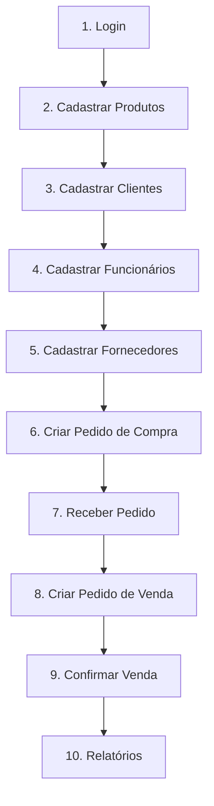

# API AutoPek - Guia Completo para Frontend

> **Documentação organizada por ordem de uso típico da aplicação**

**Base URL:** `http://localhost:5000`  
**Total:** 57 endpoints REST  
**Autenticação:** JWT Bearer Token (válido por 24h)

---

## 📋 Sumário Executivo por Ordem de Uso

### 🎯 Fluxo Recomendado de Implementação



### 📖 Índice de Seções

| # | Módulo | Rotas | Público | Descrição |
|---|--------|-------|---------|-----------|
| 1 | [Autenticação](#1-autenticação) | 4 | Parcial | Login, logout, verificação |
| 2 | [Produtos](#2-produtos) | 7 | ✅ Sim | Catálogo (públicas) + gestão (protegidas) |
| 3 | [Clientes](#3-clientes) | 8 | Registro | Cadastro e gerenciamento |
| 4 | [Funcionários](#4-funcionários) | 11 | ❌ Não | Gestão de equipe (admin) |
| 5 | [Fornecedores](#5-fornecedores) | 9 | ❌ Não | Cadastro de suppliers |
| 6 | [Pedidos de Compra](#6-pedidos-de-compra) | 8 | ❌ Não | Entrada de estoque |
| 7 | [Pedidos de Venda](#7-pedidos-de-venda) | 11 | ❌ Não | Saída de estoque e faturamento |

---

## 🔐 Credenciais Padrão

```json
{
  "email": "admin@autopeck.com",
  "senha": "admin123"
}
```
⚠️ **Altere após o primeiro login!**

---

## 🔑 Níveis de Acesso

| Nível | Permissões |
|-------|------------|
| **cliente** | Visualizar produtos (público), gerenciar próprio perfil |
| **funcionario** | Criar/editar pedidos, clientes, produtos, fornecedores |
| **admin** | Acesso total + deletar registros + gerenciar funcionários |

---

## 1. 🔐 Autenticação

> **Primeira etapa obrigatória.** Todas as rotas protegidas exigem token JWT.

### 1.1. POST `/api/auth/login` - Login

**🌐 Pública** | Retorna token JWT válido por 24h

```bash
curl -X POST http://localhost:5000/api/auth/login \
  -H "Content-Type: application/json" \
  -d '{
    "email": "admin@autopeck.com",
    "senha": "admin123"
  }'
```

**Resposta:**
```json
{
  "success": true,
  "token": "eyJhbGciOiJIUzI1NiIsInR5cCI6IkpXVCJ9...",
  "usuario": {
    "id_usuario": 1,
    "nome": "Administrador",
    "email": "admin@autopeck.com",
    "nivel_acesso_nome": "admin"
  }
}
```

---

### 1.2. POST `/api/auth/logout` - Logout

**🔒 Requer token** | Invalida token (blacklist)

```bash
curl -X POST http://localhost:5000/api/auth/logout \
  -H "Authorization: Bearer {SEU_TOKEN}"
```

---

### 1.3. GET `/api/auth/verify` - Verificar Token

**🔒 Requer token** | Valida token JWT

```bash
curl -X GET http://localhost:5000/api/auth/verify \
  -H "Authorization: Bearer {SEU_TOKEN}"
```

---

### 1.4. GET `/api/auth/me` - Dados do Usuário

**🔒 Requer token** | Retorna perfil completo do usuário autenticado

```bash
curl -X GET http://localhost:5000/api/auth/me \
  -H "Authorization: Bearer {SEU_TOKEN}"
```

---

## 2. 🛍️ Produtos

> **Segunda etapa.** Catálogo essencial para vendas. Rotas de listagem são públicas.

### 2.1. GET `/api/produtos/` - Listar Produtos

**🌐 Pública** | Lista todo o catálogo

```bash
curl -X GET http://localhost:5000/api/produtos/
```

**Resposta:**
```json
{
  "success": true,
  "produtos": [
    {
      "id_produto": 1,
      "nome": "Filtro de Óleo",
      "descricao": "Filtro para motores 1.0 a 2.0",
      "preco_venda": 45.90,
      "quantidade_em_estoque": 50,
      "preco_custo": 25.00,
      "imagens": {
        "thumbnail": "http://localhost:5000/static/images/produtos/..._thumbnail.png",
        "medium": "http://localhost:5000/static/images/produtos/..._medium.png",
        "large": "http://localhost:5000/static/images/produtos/..._large.png"
      }
    }
  ]
}
```

---

### 2.2. GET `/api/produtos/{id}` - Buscar por ID

**🌐 Pública** | Detalhes do produto

```bash
curl -X GET http://localhost:5000/api/produtos/1
```

---

### 2.3. GET `/api/produtos/buscar?nome={termo}` - Buscar por Nome

**🌐 Pública** | Busca parcial e case-insensitive

```bash
curl -X GET "http://localhost:5000/api/produtos/buscar?nome=filtro"
```

---

### 2.4. POST `/api/produtos/` - Criar Produto

**🔒 Funcionário/Admin** | Adiciona produto ao catálogo

```bash
curl -X POST http://localhost:5000/api/produtos/ \
  -H "Authorization: Bearer {TOKEN}" \
  -H "Content-Type: application/json" \
  -d '{
    "nome": "Vela de Ignição NGK",
    "descricao": "Vela padrão para motores flex",
    "preco": 29.90,
    "estoque": 100
  }'
```

**Com imagem (multipart/form-data):**
```bash
curl -X POST http://localhost:5000/api/produtos/ \
  -H "Authorization: Bearer {TOKEN}" \
  -F "nome=Vela de Ignição NGK" \
  -F "preco=29.90" \
  -F "estoque=100" \
  -F "imagem=@/caminho/foto.jpg"
```

---

### 2.5. PUT `/api/produtos/{id}` - Atualizar Produto

**🔒 Funcionário/Admin**

```bash
curl -X PUT http://localhost:5000/api/produtos/1 \
  -H "Authorization: Bearer {TOKEN}" \
  -H "Content-Type: application/json" \
  -d '{"preco": 49.90, "estoque": 75}'
```

---

### 2.6. POST `/api/produtos/{id}/imagem` - Upload Imagem

**🔒 Funcionário/Admin** | Gera 3 resoluções: thumbnail (150x150), medium (400x400), large (800x800)

```bash
curl -X POST http://localhost:5000/api/produtos/1/imagem \
  -H "Authorization: Bearer {TOKEN}" \
  -F "imagem=@/caminho/foto.jpg"
```

---

### 2.7. DELETE `/api/produtos/{id}` - Deletar Produto

**🔒 Admin**

```bash
curl -X DELETE http://localhost:5000/api/produtos/1 \
  -H "Authorization: Bearer {TOKEN}"
```

---

## 3. 👥 Clientes

> **Terceira etapa.** Cadastro de compradores. Registro público disponível.

### 3.1. POST `/api/clientes/register` - Registro Público

**🌐 Pública** | Cliente se auto-cadastra

```bash
curl -X POST http://localhost:5000/api/clientes/register \
  -H "Content-Type: application/json" \
  -d '{
    "nome": "João Silva",
    "email": "joao@email.com",
    "senha": "senha123",
    "cpf": "123.456.789-00",
    "endereco": "Rua A, 123, Centro",
    "telefone": "11999999999"
  }'
```

---

### 3.2. GET `/api/clientes/` - Listar Clientes

**🔒 Funcionário/Admin**

```bash
curl -X GET http://localhost:5000/api/clientes/ \
  -H "Authorization: Bearer {TOKEN}"
```

---

### 3.3. GET `/api/clientes/{id}` - Buscar Cliente por ID

**🔒 Funcionário/Admin**

```bash
curl -X GET http://localhost:5000/api/clientes/1 \
  -H "Authorization: Bearer {TOKEN}"
```

---

### 3.4. GET `/api/clientes/cpf/{cpf}` - Buscar por CPF

**🔒 Funcionário/Admin**

```bash
curl -X GET http://localhost:5000/api/clientes/cpf/12345678900 \
  -H "Authorization: Bearer {TOKEN}"
```

---

### 3.5. PUT `/api/clientes/{id}` - Atualizar Cliente

**🔒 Funcionário/Admin** | Campos opcionais: nome, email, cpf, endereco, telefone

```bash
curl -X PUT http://localhost:5000/api/clientes/1 \
  -H "Authorization: Bearer {TOKEN}" \
  -H "Content-Type: application/json" \
  -d '{"telefone": "11988887777", "endereco": "Rua Nova, 456"}'
```

---

### 3.6. PUT `/api/clientes/{id}/senha` - Alterar Senha

**🔒 Próprio cliente ou Admin**

```bash
curl -X PUT http://localhost:5000/api/clientes/1/senha \
  -H "Authorization: Bearer {TOKEN}" \
  -H "Content-Type: application/json" \
  -d '{"senha_atual": "senha123", "senha_nova": "novaSenha456"}'
```

---

### 3.7. PUT `/api/clientes/{id}/desativar` - Desativar Cliente

**🔒 Funcionário/Admin**

```bash
curl -X PUT http://localhost:5000/api/clientes/1/desativar \
  -H "Authorization: Bearer {TOKEN}"
```

---

### 3.8. PUT `/api/clientes/{id}/ativar` - Ativar Cliente

**🔒 Funcionário/Admin**

```bash
curl -X PUT http://localhost:5000/api/clientes/1/ativar \
  -H "Authorization: Bearer {TOKEN}"
```

---

## 4. 👔 Funcionários

> **Quarta etapa.** Gestão de equipe. Acesso restrito a admin.

### 4.1. POST `/api/funcionarios/` - Criar Funcionário

**🔒 Admin** | Campos: nome, email, senha, cargo, salario, [data_contratacao], [telefone], [nivel_acesso]

```bash
curl -X POST http://localhost:5000/api/funcionarios/ \
  -H "Authorization: Bearer {TOKEN}" \
  -H "Content-Type: application/json" \
  -d '{
    "nome": "Maria Santos",
    "email": "maria@autopek.com",
    "senha": "senha123",
    "cargo": "Vendedora",
    "salario": 2500.00,
    "telefone": "11977776666",
    "nivel_acesso": "funcionario"
  }'
```

---

### 4.2. GET `/api/funcionarios/` - Listar Funcionários

**🔒 Funcionário/Admin**

```bash
curl -X GET http://localhost:5000/api/funcionarios/ \
  -H "Authorization: Bearer {TOKEN}"
```

---

### 4.3. GET `/api/funcionarios/{id}` - Buscar por ID

**🔒 Funcionário/Admin**

```bash
curl -X GET http://localhost:5000/api/funcionarios/1 \
  -H "Authorization: Bearer {TOKEN}"
```

---

### 4.4. GET `/api/funcionarios/cargo/{cargo}` - Buscar por Cargo

**🔒 Funcionário/Admin**

```bash
curl -X GET http://localhost:5000/api/funcionarios/cargo/Vendedor \
  -H "Authorization: Bearer {TOKEN}"
```

---

### 4.5. PUT `/api/funcionarios/{id}` - Atualizar Funcionário

**🔒 Admin**

```bash
curl -X PUT http://localhost:5000/api/funcionarios/1 \
  -H "Authorization: Bearer {TOKEN}" \
  -H "Content-Type: application/json" \
  -d '{"cargo": "Gerente de Vendas", "salario": 3500.00}'
```

---

### 4.6. PUT `/api/funcionarios/{id}/senha` - Alterar Senha

**🔒 Próprio funcionário ou Admin**

```bash
curl -X PUT http://localhost:5000/api/funcionarios/1/senha \
  -H "Authorization: Bearer {TOKEN}" \
  -H "Content-Type: application/json" \
  -d '{"senha_atual": "senha123", "senha_nova": "novaSenha456"}'
```

---

### 4.7. PUT `/api/funcionarios/{id}/aumento` - Dar Aumento

**🔒 Admin** | Campo: percentual (float, ex: 10.5 para 10.5%)

```bash
curl -X PUT http://localhost:5000/api/funcionarios/1/aumento \
  -H "Authorization: Bearer {TOKEN}" \
  -H "Content-Type: application/json" \
  -d '{"percentual": 10.0}'
```

---

### 4.8. PUT `/api/funcionarios/{id}/promover` - Promover Funcionário

**🔒 Admin** | Campos: novo_cargo, [novo_salario]

```bash
curl -X PUT http://localhost:5000/api/funcionarios/1/promover \
  -H "Authorization: Bearer {TOKEN}" \
  -H "Content-Type: application/json" \
  -d '{"novo_cargo": "Supervisor", "novo_salario": 4000.00}'
```

---

### 4.9. PUT `/api/funcionarios/{id}/nivel-acesso` - Alterar Nível

**🔒 Admin** | Campo: nivel_acesso ("funcionario" ou "admin")

```bash
curl -X PUT http://localhost:5000/api/funcionarios/1/nivel-acesso \
  -H "Authorization: Bearer {TOKEN}" \
  -H "Content-Type: application/json" \
  -d '{"nivel_acesso": "admin"}'
```

---

### 4.10. PUT `/api/funcionarios/{id}/desativar` - Desativar

**🔒 Admin**

```bash
curl -X PUT http://localhost:5000/api/funcionarios/1/desativar \
  -H "Authorization: Bearer {TOKEN}"
```

---

### 4.11. PUT `/api/funcionarios/{id}/ativar` - Ativar

**🔒 Admin**

```bash
curl -X PUT http://localhost:5000/api/funcionarios/1/ativar \
  -H "Authorization: Bearer {TOKEN}"
```

---

## 5. 🏪 Fornecedores

> **Quinta etapa.** Cadastro de suppliers para pedidos de compra.

### 5.1. POST `/api/fornecedores/` - Criar Fornecedor

**🔒 Funcionário/Admin** | Validação de CNPJ brasileiro. Campos: cnpj, nome_fantasia, [contato]

```bash
curl -X POST http://localhost:5000/api/fornecedores \
  -H "Authorization: Bearer {TOKEN}" \
  -H "Content-Type: application/json" \
  -d '{
    "cnpj": "12.345.678/0001-90",
    "nome_fantasia": "Distribuidora AutoParts",
    "contato": "contato@autoparts.com | (11) 98765-4321"
  }'
```

**Resposta:**
```json
{
  "success": true,
  "message": "Fornecedor criado com sucesso",
  "fornecedor": {
    "id_fornecedor": 1,
    "cnpj": "12.345.678/0001-90",
    "nome_fantasia": "Distribuidora AutoParts",
    "contato": "contato@autoparts.com | (11) 98765-4321"
  }
}
```

---

### 5.2. GET `/api/fornecedores/` - Listar Fornecedores

**🔒 Funcionário/Admin**

```bash
curl -X GET http://localhost:5000/api/fornecedores \
  -H "Authorization: Bearer {TOKEN}"
```

---

### 5.3. GET `/api/fornecedores/{id}` - Buscar por ID

**🔒 Funcionário/Admin**

```bash
curl -X GET http://localhost:5000/api/fornecedores/1 \
  -H "Authorization: Bearer {TOKEN}"
```

---

### 5.4. GET `/api/fornecedores/buscar?nome={termo}` - Buscar por Nome

**🔒 Funcionário/Admin**

```bash
curl -X GET "http://localhost:5000/api/fornecedores/buscar?nome=distribuidora" \
  -H "Authorization: Bearer {TOKEN}"
```

---

### 5.5. PUT `/api/fornecedores/{id}` - Atualizar Fornecedor

**🔒 Funcionário/Admin**

```bash
curl -X PUT http://localhost:5000/api/fornecedores/1 \
  -H "Authorization: Bearer {TOKEN}" \
  -H "Content-Type: application/json" \
  -d '{"nome_fantasia": "Novo Nome", "contato": "novo@email.com"}'
```

---

### 5.6. PATCH `/api/fornecedores/{id}/desativar` - Desativar Fornecedor

**🔒 Funcionário/Admin** | Soft delete

```bash
curl -X PATCH http://localhost:5000/api/fornecedores/1/desativar \
  -H "Authorization: Bearer {TOKEN}"
```

**Resposta:**
```json
{
  "success": true,
  "message": "Fornecedor desativado com sucesso"
}
```

---

### 5.7. PATCH `/api/fornecedores/{id}/ativar` - Ativar Fornecedor

**🔒 Funcionário/Admin**

```bash
curl -X PATCH http://localhost:5000/api/fornecedores/1/ativar \
  -H "Authorization: Bearer {TOKEN}"
```

**Resposta:**
```json
{
  "success": true,
  "message": "Fornecedor ativado com sucesso"
}
```

---

### 5.8. DELETE `/api/fornecedores/{id}` - Deletar Fornecedor

**🔒 Admin** | ⚠️ Não permite se houver pedidos vinculados

```bash
curl -X DELETE http://localhost:5000/api/fornecedores/1 \
  -H "Authorization: Bearer {TOKEN}"
```

---

### 5.9. GET `/api/fornecedores/estatisticas` - Estatísticas

**🔒 Funcionário/Admin**

```bash
curl -X GET http://localhost:5000/api/fornecedores/estatisticas \
  -H "Authorization: Bearer {TOKEN}"
```

**Resposta:**
```json
{
  "success": true,
  "estatisticas": {
    "total_fornecedores": 10,
    "fornecedores_com_pedidos": 7
  }
}
```

---

## 6. 📦 Pedidos de Compra

> **Sexta etapa.** Entrada de estoque. Cria pedidos, recebe mercadorias e atualiza estoque automaticamente.

### 6.1. POST `/api/pedidos-compra/` - Criar Pedido

**🔒 Funcionário/Admin** | Campos: id_fornecedor, itens[{id_produto, quantidade, preco_custo_unitario}]

```bash
curl -X POST http://localhost:5000/api/pedidos-compra \
  -H "Authorization: Bearer {TOKEN}" \
  -H "Content-Type: application/json" \
  -d '{
    "id_fornecedor": 1,
    "itens": [
      {"id_produto": 1, "quantidade": 10, "preco_custo_unitario": 50.00},
      {"id_produto": 2, "quantidade": 5, "preco_custo_unitario": 30.00}
    ]
  }'
```

**Resposta:**
```json
{
  "success": true,
  "message": "Pedido de compra criado com sucesso",
  "pedido": {
    "id_pedido_compra": 1,
    "id_fornecedor": 1,
    "status": "Pendente",
    "valor_total": 650.00,
    "data_pedido": "2025-11-09"
  }
}
```

---

### 6.2. GET `/api/pedidos-compra/` - Listar Pedidos

**🔒 Funcionário/Admin** | Query opcional: ?status=Pendente

```bash
# Todos os pedidos
curl -X GET http://localhost:5000/api/pedidos-compra \
  -H "Authorization: Bearer {TOKEN}"

# Filtrar por status
curl -X GET "http://localhost:5000/api/pedidos-compra?status=Pendente" \
  -H "Authorization: Bearer {TOKEN}"
```

**Status válidos:** `Pendente`, `Aprovado`, `Enviado`, `Recebido`, `Cancelado`

---

### 6.3. GET `/api/pedidos-compra/{id}` - Buscar Pedido por ID

**🔒 Funcionário/Admin** | Retorna pedido com lista de itens

```bash
curl -X GET http://localhost:5000/api/pedidos-compra/1 \
  -H "Authorization: Bearer {TOKEN}"
```

**Resposta:**
```json
{
  "success": true,
  "pedido": {
    "id_pedido_compra": 1,
    "id_fornecedor": 1,
    "fornecedor_nome": "Distribuidora AutoParts",
    "status": "Pendente",
    "valor_total": 650.00,
    "data_pedido": "2025-11-09",
    "itens": [
      {
        "id_item": 1,
        "produto_nome": "Filtro de Óleo",
        "quantidade": 10,
        "preco_custo_unitario": 50.00,
        "subtotal": 500.00
      },
      {
        "id_item": 2,
        "produto_nome": "Correia Dentada",
        "quantidade": 5,
        "preco_custo_unitario": 30.00,
        "subtotal": 150.00
      }
    ]
  }
}
```

---

### 6.4. POST `/api/pedidos-compra/{id}/itens` - Adicionar Itens

**🔒 Funcionário/Admin** | Adiciona produtos ao pedido existente

```bash
curl -X POST http://localhost:5000/api/pedidos-compra/1/itens \
  -H "Authorization: Bearer {TOKEN}" \
  -H "Content-Type: application/json" \
  -d '{
    "itens": [
      {"id_produto": 3, "quantidade": 15, "preco_custo_unitario": 25.00}
    ]
  }'
```

---

### 6.5. PUT `/api/pedidos-compra/{id}/status` - Atualizar Status

**🔒 Funcionário/Admin**

```bash
curl -X PUT http://localhost:5000/api/pedidos-compra/1/status \
  -H "Authorization: Bearer {TOKEN}" \
  -H "Content-Type: application/json" \
  -d '{"status": "Aprovado"}'
```

---

### 6.6. POST `/api/pedidos-compra/{id}/receber` - Receber Pedido ⭐

**🔒 Funcionário/Admin** | **AÇÃO CRÍTICA:** Incrementa estoque e atualiza custo médio

```bash
curl -X POST http://localhost:5000/api/pedidos-compra/1/receber \
  -H "Authorization: Bearer {TOKEN}"
```

**O que acontece:**
1. Status muda para "Recebido"
2. **Estoque de cada produto é incrementado**
3. **Preço de custo médio é atualizado** usando fórmula:
   ```
   novo_custo = (qtd_antiga × custo_antigo + qtd_nova × custo_novo) / (qtd_antiga + qtd_nova)
   ```

**Resposta:**
```json
{
  "success": true,
  "message": "Pedido recebido com sucesso. Estoque atualizado."
}
```

---

### 6.7. POST `/api/pedidos-compra/{id}/cancelar` - Cancelar Pedido

**🔒 Funcionário/Admin** | Não pode cancelar se já recebido

```bash
curl -X POST http://localhost:5000/api/pedidos-compra/1/cancelar \
  -H "Authorization: Bearer {TOKEN}"
```

---

### 6.8. GET `/api/pedidos-compra/relatorio` - Relatório de Compras

**🔒 Funcionário/Admin** | Query opcional: ?data_inicio=YYYY-MM-DD&data_fim=YYYY-MM-DD

```bash
# Relatório completo
curl -X GET http://localhost:5000/api/pedidos-compra/relatorio \
  -H "Authorization: Bearer {TOKEN}"

# Relatório filtrado
curl -X GET "http://localhost:5000/api/pedidos-compra/relatorio?data_inicio=2025-01-01&data_fim=2025-12-31" \
  -H "Authorization: Bearer {TOKEN}"
```

---

## 7. 🛒 Pedidos de Venda

> **Sétima etapa.** Saída de estoque e faturamento. Valida estoque, deduz quantidade e calcula lucro.

### 7.1. POST `/api/pedidos-venda/` - Criar Pedido

**🔒 Funcionário/Admin** | Valida estoque disponível. Campos: id_cliente, itens[{id_produto, quantidade, preco_venda_unitario}]

```bash
curl -X POST http://localhost:5000/api/pedidos-venda \
  -H "Authorization: Bearer {TOKEN}" \
  -H "Content-Type: application/json" \
  -d '{
    "id_cliente": 1,
    "itens": [
      {"id_produto": 1, "quantidade": 2, "preco_venda_unitario": 99.90},
      {"id_produto": 2, "quantidade": 1, "preco_venda_unitario": 149.90}
    ]
  }'
```

**Resposta:**
```json
{
  "success": true,
  "message": "Pedido de venda criado com sucesso",
  "pedido": {
    "id_pedido_venda": 1,
    "id_cliente": 1,
    "status": "Pendente",
    "valor_total": 349.70,
    "data_pedido": "2025-11-09"
  }
}
```

---

### 7.2. GET `/api/pedidos-venda/` - Listar Pedidos

**🔒 Funcionário/Admin** | Query opcional: ?status=Confirmado

```bash
# Todos
curl -X GET http://localhost:5000/api/pedidos-venda \
  -H "Authorization: Bearer {TOKEN}"

# Filtrar
curl -X GET "http://localhost:5000/api/pedidos-venda?status=Confirmado" \
  -H "Authorization: Bearer {TOKEN}"
```

**Status válidos:** `Pendente`, `Confirmado`, `Preparando`, `Enviado`, `Entregue`, `Cancelado`

---

### 7.3. GET `/api/pedidos-venda/{id}` - Buscar Pedido por ID

**🔒 Funcionário/Admin**

```bash
curl -X GET http://localhost:5000/api/pedidos-venda/1 \
  -H "Authorization: Bearer {TOKEN}"
```

---

### 7.4. POST `/api/pedidos-venda/{id}/itens` - Adicionar Itens

**🔒 Funcionário/Admin** | ⚠️ Valida estoque antes de adicionar

```bash
curl -X POST http://localhost:5000/api/pedidos-venda/1/itens \
  -H "Authorization: Bearer {TOKEN}" \
  -H "Content-Type: application/json" \
  -d '{
    "itens": [
      {"id_produto": 3, "quantidade": 1, "preco_venda_unitario": 79.90}
    ]
  }'
```

---

### 7.5. PUT `/api/pedidos-venda/{id}/status` - Atualizar Status

**🔒 Funcionário/Admin**

```bash
curl -X PUT http://localhost:5000/api/pedidos-venda/1/status \
  -H "Authorization: Bearer {TOKEN}" \
  -H "Content-Type: application/json" \
  -d '{"status": "Preparando"}'
```

---

### 7.6. POST `/api/pedidos-venda/{id}/confirmar` - Confirmar Pedido ⭐

**🔒 Funcionário/Admin** | **AÇÃO CRÍTICA:** Deduz estoque

```bash
curl -X POST http://localhost:5000/api/pedidos-venda/1/confirmar \
  -H "Authorization: Bearer {TOKEN}"
```

**O que acontece:**
1. Valida estoque disponível de todos os itens
2. Status muda para "Confirmado"
3. **Estoque de cada produto é decrementado**

**Resposta:**
```json
{
  "success": true,
  "message": "Pedido confirmado com sucesso. Estoque atualizado."
}
```

**Erro se estoque insuficiente:**
```json
{
  "success": false,
  "message": "Estoque insuficiente para Filtro de Óleo. Disponível: 3, Necessário: 5"
}
```

---

### 7.7. POST `/api/pedidos-venda/{id}/cancelar` - Cancelar Pedido

**🔒 Funcionário/Admin** | Query opcional: ?devolver_estoque=true/false (padrão: true)

```bash
# Cancelar e devolver estoque (padrão)
curl -X POST http://localhost:5000/api/pedidos-venda/1/cancelar \
  -H "Authorization: Bearer {TOKEN}"

# Cancelar sem devolver
curl -X POST "http://localhost:5000/api/pedidos-venda/1/cancelar?devolver_estoque=false" \
  -H "Authorization: Bearer {TOKEN}"
```

**Resposta:**
```json
{
  "success": true,
  "message": "Pedido cancelado com sucesso. Estoque devolvido."
}
```

---

### 7.8. GET `/api/pedidos-venda/{id}/lucro` - Calcular Lucro 💰

**🔒 Funcionário/Admin** | Retorna análise financeira do pedido

```bash
curl -X GET http://localhost:5000/api/pedidos-venda/1/lucro \
  -H "Authorization: Bearer {TOKEN}"
```

**Resposta:**
```json
{
  "success": true,
  "lucro": {
    "valor_venda": 349.70,
    "custo_total": 200.00,
    "lucro_bruto": 149.70,
    "margem_percentual": 42.8
  }
}
```

**Fórmulas:**
- `lucro_bruto = valor_venda - custo_total`
- `margem_percentual = (lucro_bruto / valor_venda) × 100`

---

### 7.9. GET `/api/pedidos-venda/relatorio` - Relatório de Vendas

**🔒 Funcionário/Admin** | Query opcional: ?data_inicio=YYYY-MM-DD&data_fim=YYYY-MM-DD

```bash
# Completo
curl -X GET http://localhost:5000/api/pedidos-venda/relatorio \
  -H "Authorization: Bearer {TOKEN}"

# Filtrado
curl -X GET "http://localhost:5000/api/pedidos-venda/relatorio?data_inicio=2025-01-01&data_fim=2025-12-31" \
  -H "Authorization: Bearer {TOKEN}"
```

---

### 7.10. GET `/api/pedidos-venda/produtos-mais-vendidos` - Top Produtos

**🔒 Funcionário/Admin** | Query opcional: ?limite=5 (padrão: 10)

```bash
# Top 10 (padrão)
curl -X GET http://localhost:5000/api/pedidos-venda/produtos-mais-vendidos \
  -H "Authorization: Bearer {TOKEN}"

# Top 5
curl -X GET "http://localhost:5000/api/pedidos-venda/produtos-mais-vendidos?limite=5" \
  -H "Authorization: Bearer {TOKEN}"
```

**Resposta:**
```json
{
  "success": true,
  "produtos": [
    {
      "id_produto": 1,
      "nome": "Filtro de Óleo",
      "quantidade_total_vendida": 150,
      "receita_total": 6885.00
    }
  ],
  "total": 5
}
```

---

## 🔄 Fluxo Completo de Uso

### Cenário: Do Login à Primeira Venda

```bash
# 1. Login
TOKEN=$(curl -s -X POST http://localhost:5000/api/auth/login \
  -H "Content-Type: application/json" \
  -d '{"email":"admin@autopeck.com","senha":"admin123"}' \
  | jq -r '.token')

# 2. Cadastrar produto
curl -X POST http://localhost:5000/api/produtos/ \
  -H "Authorization: Bearer $TOKEN" \
  -H "Content-Type: application/json" \
  -d '{"nome":"Filtro de Óleo","preco":45.90,"estoque":0}'

# 3. Cadastrar fornecedor
curl -X POST http://localhost:5000/api/fornecedores \
  -H "Authorization: Bearer $TOKEN" \
  -H "Content-Type: application/json" \
  -d '{"cnpj":"12.345.678/0001-90","nome_fantasia":"AutoParts Ltda","contato":"contato@autoparts.com"}'

# 4. Criar pedido de compra
curl -X POST http://localhost:5000/api/pedidos-compra \
  -H "Authorization: Bearer $TOKEN" \
  -H "Content-Type: application/json" \
  -d '{"id_fornecedor":1,"itens":[{"id_produto":1,"quantidade":50,"preco_custo_unitario":25.00}]}'

# 5. Receber pedido (INCREMENTA ESTOQUE)
curl -X POST http://localhost:5000/api/pedidos-compra/1/receber \
  -H "Authorization: Bearer $TOKEN"

# 6. Cadastrar cliente (público)
curl -X POST http://localhost:5000/api/clientes/register \
  -H "Content-Type: application/json" \
  -d '{"nome":"João Silva","email":"joao@email.com","senha":"senha123","cpf":"12345678900","endereco":"Rua A, 123","telefone":"11999999999"}'

# 7. Criar pedido de venda
curl -X POST http://localhost:5000/api/pedidos-venda \
  -H "Authorization: Bearer $TOKEN" \
  -H "Content-Type: application/json" \
  -d '{"id_cliente":1,"itens":[{"id_produto":1,"quantidade":2,"preco_venda_unitario":45.90}]}'

# 8. Confirmar venda (DECREMENTA ESTOQUE)
curl -X POST http://localhost:5000/api/pedidos-venda/1/confirmar \
  -H "Authorization: Bearer $TOKEN"

# 9. Ver lucro
curl -X GET http://localhost:5000/api/pedidos-venda/1/lucro \
  -H "Authorization: Bearer $TOKEN"
```

---

## ⚙️ Funcionalidades Avançadas

### 🎯 Controle Automático de Estoque

| Ação | Efeito no Estoque |
|------|-------------------|
| **Receber Pedido de Compra** | ➕ Incrementa quantidade |
| **Confirmar Pedido de Venda** | ➖ Decrementa quantidade |
| **Cancelar Venda (devolver=true)** | ➕ Devolve ao estoque |
| **Cancelar Venda (devolver=false)** | Sem alteração |

### 💰 Cálculo de Custo Médio Ponderado

Ao receber pedido de compra:

```
novo_custo = (estoque_antigo × custo_antigo) + (qtd_recebida × custo_novo)
             ─────────────────────────────────────────────────────────────
                        estoque_antigo + qtd_recebida
```

**Exemplo:**
- Estoque atual: 10 unidades a R$ 20,00 = R$ 200,00
- Nova compra: 5 unidades a R$ 25,00 = R$ 125,00
- **Novo custo médio:** (200 + 125) / (10 + 5) = R$ 21,67

### ✅ Validações de Negócio

| Validação | Regra |
|-----------|-------|
| **CNPJ** | Algoritmo brasileiro de verificação (2 dígitos) |
| **CPF** | Formato: 11 dígitos |
| **Estoque** | Valida disponibilidade antes de venda |
| **Preços** | Devem ser > 0 |
| **Status** | Pedidos finalizados não podem ser modificados |
| **Deleção de Fornecedor** | Não permite se tiver pedidos vinculados |

### 📊 Relatórios Disponíveis

1. **Compras por Período** - `/api/pedidos-compra/relatorio`
2. **Vendas por Período** - `/api/pedidos-venda/relatorio`
3. **Produtos Mais Vendidos** - `/api/pedidos-venda/produtos-mais-vendidos`
4. **Lucro por Pedido** - `/api/pedidos-venda/{id}/lucro`
5. **Estatísticas de Fornecedores** - `/api/fornecedores/estatisticas`

---

## 🚨 Tratamento de Erros

### Códigos HTTP

| Código | Significado | Exemplo |
|--------|-------------|---------|
| **200** | Sucesso | Operação concluída |
| **201** | Criado | Recurso criado com sucesso |
| **400** | Bad Request | Dados inválidos ou faltando |
| **401** | Unauthorized | Token ausente/inválido/expirado |
| **403** | Forbidden | Sem permissão (nível de acesso) |
| **404** | Not Found | Recurso não encontrado |
| **500** | Server Error | Erro interno do servidor |

### Estrutura de Erro

```json
{
  "success": false,
  "message": "Descrição do erro"
}
```

### Exemplos Comuns

**Token expirado:**
```json
{
  "message": "Token expirado"
}
```

**Sem permissão:**
```json
{
  "success": false,
  "message": "Acesso negado: Requer nível admin"
}
```

**Estoque insuficiente:**
```json
{
  "success": false,
  "message": "Estoque insuficiente para Filtro de Óleo. Disponível: 3, Necessário: 5"
}
```

**CNPJ inválido:**
```json
{
  "success": false,
  "message": "CNPJ inválido"
}
```

---

## 📝 Notas Técnicas

### Autenticação JWT

- **Header:** `Authorization: Bearer {token}`
- **Validade:** 24 horas
- **Algoritmo:** HS256
- **Blacklist:** Tokens invalidados no logout

### Formatos de Data

- **Input:** `YYYY-MM-DD` (ex: 2025-11-09)
- **Output:** `YYYY-MM-DD HH:MM:SS` (ex: 2025-11-09 14:30:00)

### Tipos de Dados

| Campo | Tipo | Formato |
|-------|------|---------|
| **Preços** | float | 99.90 (ponto como separador decimal) |
| **Quantidades** | int | 10 |
| **CPF** | string | "12345678900" (sem pontuação) |
| **CNPJ** | string | "12.345.678/0001-90" (com ou sem pontuação) |
| **Email** | string | "user@email.com" |

### Upload de Imagens

- **Formatos aceitos:** PNG, JPG, JPEG
- **Tamanho máximo:** Configurável no servidor
- **Processamento:** Gera 3 resoluções automaticamente
  - thumbnail: 150x150px
  - medium: 400x400px
  - large: 800x800px

---

## 🔗 Recursos Adicionais

### Documentação Técnica

- [Modelagem do Banco de Dados](./modelagem_geral.md)
- [Documentação dos DAOs](./DAOS_IMPLEMENTADOS.md)
- [Scripts SQL](./banco_sqlite.sql)

### Repositório

- **GitHub:** `https://github.com/joaovitorvlb/api_autopek`
- **Branch:** `master`

---

## 📞 Suporte

Para dúvidas ou problemas:
- Consulte a documentação técnica completa
- Verifique os logs do servidor
- Entre em contato com a equipe de desenvolvimento

---

**Versão do Documento:** 2.1  
**Última Atualização:** 10/11/2025  
**Total de Endpoints:** 57
