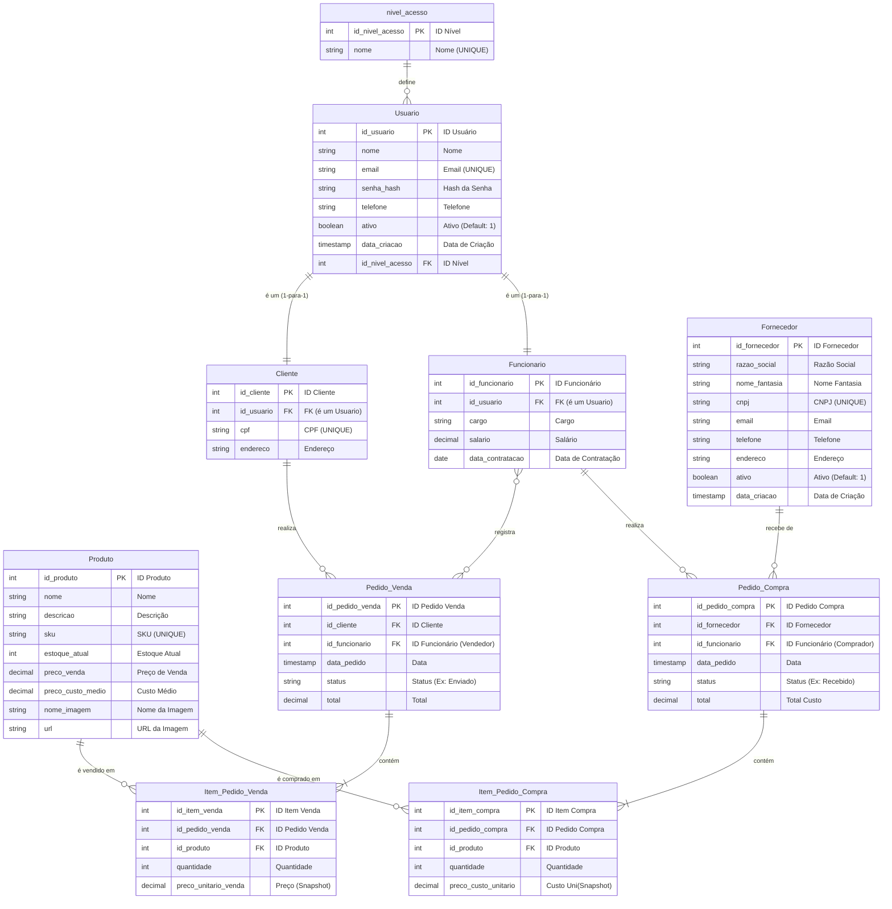

---

## 📖 Documentação dos Fluxos do Sistema

### 🧑‍💼 **1. FLUXO DE USUÁRIOS (Herança e Controle de Acesso)**

#### **Arquitetura de Herança**
```
nivel_acesso (admin, funcionario, cliente)
    ↓
Usuario (dados comuns: nome, email, senha_hash, telefone, ativo, data_criacao)
    ↓
    ├─→ Cliente (dados específicos: cpf, endereco)
    └─→ Funcionario (dados específicos: cargo, salario, data_contratacao)
```

#### **Funcionamento:**

**1.1. Cadastro de Novo Usuário**
- Criar registro em `Usuario` com:
  - Nome, email, senha (hash), telefone
  - `id_nivel_acesso` → Define se é admin/funcionario/cliente
  - `ativo = 1` (usuário ativo por padrão)
  - `data_criacao = CURRENT_TIMESTAMP`

**1.2. Especialização (Cliente ou Funcionario)**
- **Se for Cliente:**
  - Criar registro em `Cliente` com `id_usuario` (FK)
  - Adicionar CPF e endereço
  
- **Se for Funcionário:**
  - Criar registro em `Funcionario` com `id_usuario` (FK)
  - Adicionar cargo, salário e data de contratação

**1.3. Login e Autenticação**
```sql
-- Buscar usuário por email e verificar senha
SELECT u.*, na.nome as nivel_acesso
FROM Usuario u
JOIN nivel_acesso na ON u.id_nivel_acesso = na.id_nivel_acesso
WHERE u.email = ? AND u.senha_hash = ? AND u.ativo = 1
```

**1.4. Identificar Tipo de Usuário**
```sql
-- Verificar se é cliente
SELECT c.*, u.nome, u.email, u.telefone
FROM Cliente c
JOIN Usuario u ON c.id_usuario = u.id_usuario
WHERE c.id_usuario = ?

-- Verificar se é funcionário
SELECT f.*, u.nome, u.email, u.telefone
FROM Funcionario f
JOIN Usuario u ON f.id_usuario = u.id_usuario
WHERE f.id_usuario = ?
```

**Vantagens:**
- ✅ Uma pessoa pode ser Cliente E Funcionário (dois registros referenciando o mesmo `id_usuario`)
- ✅ Dados comuns (nome, email, telefone) não são duplicados
- ✅ Sistema de login unificado
- ✅ Controle centralizado de acesso via `nivel_acesso`

---

### 📦 **2. FLUXO DE ENTRADA (Processo de Suprimentos/Compras)**

#### **Objetivo:** Registrar compra de produtos de fornecedores (AUMENTA estoque)

```
Fornecedor → Pedido_Compra → Item_Pedido_Compra → Produto (estoque ↑)
              ↑
         Funcionario
         (comprador)
```

#### **Passo a Passo:**

**2.1. Cadastrar Fornecedor**
```sql
INSERT INTO Fornecedor (razao_social, nome_fantasia, cnpj, email, telefone, endereco, ativo, data_criacao)
VALUES ('Auto Peças Brasil LTDA', 'AutoPeças Brasil', '12.345.678/0001-90', 
        'compras@autopecas.com.br', '11988887777', 'Rua Industrial, 100', 1, CURRENT_TIMESTAMP)
-- razao_social: Nome jurídico registrado (obrigatório para CNPJ)
-- nome_fantasia: Nome comercial (pode ser diferente da razão social)
-- email/telefone: Campos separados para melhor validação
-- ativo: Permite soft delete (desativar sem excluir)
```

**2.2. Criar Pedido de Compra**
```sql
INSERT INTO Pedido_Compra (id_fornecedor, id_funcionario, data_pedido, status, total)
VALUES (1, 5, NOW(), 'Pendente', 0.00)
-- id_funcionario = funcionário responsável pela compra
-- status: 'Pendente' → 'Aprovado' → 'Enviado' → 'Recebido' → 'Cancelado'
```

**2.3. Adicionar Itens ao Pedido**
```sql
INSERT INTO Item_Pedido_Compra (id_pedido_compra, id_produto, quantidade, preco_custo_unitario)
VALUES 
  (1, 10, 50, 25.00),  -- 50 filtros a R$ 25,00 cada
  (1, 15, 30, 45.00)   -- 30 pastilhas a R$ 45,00 cada
```

**2.4. Atualizar Total do Pedido**
```sql
UPDATE Pedido_Compra
SET total = (
    SELECT SUM(quantidade * preco_custo_unitario)
    FROM Item_Pedido_Compra
    WHERE id_pedido_compra = 1
)
WHERE id_pedido_compra = 1
-- Total = (50 × 25.00) + (30 × 45.00) = 1.250,00 + 1.350,00 = R$ 2.600,00
```

**2.5. Receber Mercadoria (Dar Entrada no Estoque)**
```sql
-- Marcar pedido como recebido
UPDATE Pedido_Compra
SET status = 'Recebido'
WHERE id_pedido_compra = 1

-- Atualizar estoque de cada produto
UPDATE Produto p
SET 
  estoque_atual = estoque_atual + (
    SELECT quantidade 
    FROM Item_Pedido_Compra 
    WHERE id_pedido_compra = 1 AND id_produto = p.id_produto
  ),
  preco_custo_medio = (
    (estoque_atual * preco_custo_medio) + 
    (SELECT quantidade * preco_custo_unitario 
     FROM Item_Pedido_Compra 
     WHERE id_pedido_compra = 1 AND id_produto = p.id_produto)
  ) / (estoque_atual + SELECT quantidade 
                       FROM Item_Pedido_Compra 
                       WHERE id_pedido_compra = 1 AND id_produto = p.id_produto)
WHERE id_produto IN (SELECT id_produto FROM Item_Pedido_Compra WHERE id_pedido_compra = 1)
```

**Exemplo Numérico:**
```
Produto: Filtro de Óleo (id_produto = 10)
- Estoque anterior: 20 unidades
- Custo médio anterior: R$ 22,00
- Compra: 50 unidades a R$ 25,00

Novo estoque: 20 + 50 = 70 unidades
Novo custo médio: [(20 × 22,00) + (50 × 25,00)] / 70
                = [440,00 + 1.250,00] / 70
                = 1.690,00 / 70
                = R$ 24,14
```

**Ciclo de Status do Pedido de Compra:**
1. `Pendente` → Pedido criado, aguardando aprovação
2. `Aprovado` → Pedido autorizado, enviado ao fornecedor
3. `Enviado` → Fornecedor despachou a mercadoria
4. `Recebido` → Mercadoria chegou e foi dado entrada no estoque ✅
5. `Cancelado` → Pedido cancelado (não afeta estoque)

---

### 🛒 **3. FLUXO DE SAÍDA (Processo de Varejo/Vendas)**

#### **Objetivo:** Registrar venda de produtos para clientes (DIMINUI estoque)

```
Cliente → Pedido_Venda → Item_Pedido_Venda → Produto (estoque ↓)
            ↑
       Funcionario
       (vendedor)
```

#### **Passo a Passo:**

**3.1. Cliente Seleciona Produtos**
```sql
-- Cliente já deve estar cadastrado
SELECT id_cliente FROM Cliente 
WHERE id_usuario = (SELECT id_usuario FROM Usuario WHERE email = 'joao.silva@email.com')
```

**3.2. Criar Pedido de Venda**
```sql
INSERT INTO Pedido_Venda (id_cliente, id_funcionario, data_pedido, status, total)
VALUES (3, 5, NOW(), 'Pendente', 0.00)
-- id_cliente = cliente que está comprando
-- id_funcionario = vendedor que está atendendo (pode ser NULL para vendas online)
-- status: 'Pendente' → 'Confirmado' → 'Separado' → 'Enviado' → 'Entregue' → 'Cancelado'
```

**3.3. Adicionar Itens ao Carrinho/Pedido**
```sql
INSERT INTO Item_Pedido_Venda (id_pedido_venda, id_produto, quantidade, preco_unitario_venda)
VALUES 
  (1, 10, 2, 50.00),  -- 2 filtros a R$ 50,00 cada
  (1, 15, 4, 80.00)   -- 4 pastilhas a R$ 80,00 cada

-- preco_unitario_venda = snapshot do preço NO MOMENTO da venda
-- (importante caso o preço mude depois)
```

**3.4. Atualizar Total do Pedido**
```sql
UPDATE Pedido_Venda
SET total = (
    SELECT SUM(quantidade * preco_unitario_venda)
    FROM Item_Pedido_Venda
    WHERE id_pedido_venda = 1
)
WHERE id_pedido_venda = 1
-- Total = (2 × 50.00) + (4 × 80.00) = 100,00 + 320,00 = R$ 420,00
```

**3.5. Confirmar Venda (Dar Baixa no Estoque)**
```sql
-- Marcar pedido como confirmado
UPDATE Pedido_Venda
SET status = 'Confirmado'
WHERE id_pedido_venda = 1

-- Verificar disponibilidade em estoque
SELECT p.id_produto, p.nome, p.estoque_atual, i.quantidade
FROM Item_Pedido_Venda i
JOIN Produto p ON i.id_produto = p.id_produto
WHERE i.id_pedido_venda = 1 AND p.estoque_atual < i.quantidade
-- Se retornar algum registro, há produtos sem estoque suficiente!

-- Dar baixa no estoque
UPDATE Produto p
SET estoque_atual = estoque_atual - (
    SELECT quantidade 
    FROM Item_Pedido_Venda 
    WHERE id_pedido_venda = 1 AND id_produto = p.id_produto
)
WHERE id_produto IN (SELECT id_produto FROM Item_Pedido_Venda WHERE id_pedido_venda = 1)
AND estoque_atual >= (SELECT quantidade FROM Item_Pedido_Venda WHERE id_pedido_venda = 1 AND id_produto = p.id_produto)
```

**Exemplo Numérico:**
```
Produto: Filtro de Óleo (id_produto = 10)
- Estoque anterior: 70 unidades
- Venda: 2 unidades

Novo estoque: 70 - 2 = 68 unidades
```

**3.6. Calcular Lucro da Venda**
```sql
SELECT 
    pv.id_pedido_venda,
    pv.total as valor_venda,
    SUM(iv.quantidade * p.preco_custo_medio) as custo_total,
    (pv.total - SUM(iv.quantidade * p.preco_custo_medio)) as lucro_bruto,
    ((pv.total - SUM(iv.quantidade * p.preco_custo_medio)) / pv.total * 100) as margem_percentual
FROM Pedido_Venda pv
JOIN Item_Pedido_Venda iv ON pv.id_pedido_venda = iv.id_pedido_venda
JOIN Produto p ON iv.id_produto = p.id_produto
WHERE pv.id_pedido_venda = 1
GROUP BY pv.id_pedido_venda

-- Exemplo:
-- Valor da venda: R$ 420,00
-- Custo total: (2 × 24,14) + (4 × 35,00) = 48,28 + 140,00 = R$ 188,28
-- Lucro bruto: 420,00 - 188,28 = R$ 231,72
-- Margem: (231,72 / 420,00) × 100 = 55,17%
```

**Ciclo de Status do Pedido de Venda:**
1. `Pendente` → Pedido criado, aguardando confirmação de pagamento
2. `Confirmado` → Pagamento confirmado, estoque reservado ✅
3. `Separado` → Produtos separados no estoque
4. `Enviado` → Pedido despachado para entrega
5. `Entregue` → Cliente recebeu o pedido
6. `Cancelado` → Pedido cancelado (estoque devolvido)

---

### 📊 **4. RELATÓRIOS E CONSULTAS ÚTEIS**

#### **4.1. Produtos com Estoque Baixo**
```sql
SELECT id_produto, nome, sku, estoque_atual, preco_venda
FROM Produto
WHERE estoque_atual < 10
ORDER BY estoque_atual ASC
```

#### **4.2. Top 10 Produtos Mais Vendidos**
```sql
SELECT 
    p.id_produto,
    p.nome,
    p.sku,
    SUM(iv.quantidade) as total_vendido,
    SUM(iv.quantidade * iv.preco_unitario_venda) as receita_total
FROM Item_Pedido_Venda iv
JOIN Produto p ON iv.id_produto = p.id_produto
JOIN Pedido_Venda pv ON iv.id_pedido_venda = pv.id_pedido_venda
WHERE pv.status IN ('Confirmado', 'Separado', 'Enviado', 'Entregue')
GROUP BY p.id_produto, p.nome, p.sku
ORDER BY total_vendido DESC
LIMIT 10
```

#### **4.3. Histórico de Compras por Fornecedor**
```sql
SELECT 
    f.razao_social,
    f.nome_fantasia,
    f.cnpj,
    f.email,
    f.telefone,
    COUNT(pc.id_pedido_compra) as total_pedidos,
    SUM(pc.total) as valor_total_comprado,
    MAX(pc.data_pedido) as ultima_compra
FROM Fornecedor f
LEFT JOIN Pedido_Compra pc ON f.id_fornecedor = pc.id_fornecedor
WHERE pc.status = 'Recebido' AND f.ativo = 1
GROUP BY f.id_fornecedor, f.razao_social, f.nome_fantasia, f.cnpj, f.email, f.telefone
ORDER BY valor_total_comprado DESC
```

#### **4.4. Vendas por Cliente**
```sql
SELECT 
    u.nome as cliente,
    u.email,
    c.cpf,
    COUNT(pv.id_pedido_venda) as total_pedidos,
    SUM(pv.total) as valor_total_gasto,
    MAX(pv.data_pedido) as ultima_compra
FROM Cliente c
JOIN Usuario u ON c.id_usuario = u.id_usuario
LEFT JOIN Pedido_Venda pv ON c.id_cliente = pv.id_cliente
WHERE pv.status IN ('Confirmado', 'Separado', 'Enviado', 'Entregue')
GROUP BY c.id_cliente, u.nome, u.email, c.cpf
ORDER BY valor_total_gasto DESC
```

#### **4.5. Performance de Vendedores**
```sql
SELECT 
    u.nome as vendedor,
    f.cargo,
    COUNT(pv.id_pedido_venda) as total_vendas,
    SUM(pv.total) as valor_total_vendido,
    AVG(pv.total) as ticket_medio
FROM Funcionario f
JOIN Usuario u ON f.id_usuario = u.id_usuario
LEFT JOIN Pedido_Venda pv ON f.id_funcionario = pv.id_funcionario
WHERE pv.status IN ('Confirmado', 'Separado', 'Enviado', 'Entregue')
GROUP BY f.id_funcionario, u.nome, f.cargo
ORDER BY valor_total_vendido DESC
```

---

### 🔄 **5. REGRAS DE NEGÓCIO IMPORTANTES**

#### **5.1. Integridade de Dados**
- ✅ Todo `Cliente` e `Funcionario` DEVE ter um `Usuario` associado
- ✅ Email deve ser único na tabela `Usuario`
- ✅ CPF deve ser único na tabela `Cliente`
- ✅ CNPJ deve ser único na tabela `Fornecedor`
- ✅ SKU deve ser único na tabela `Produto`

#### **5.2. Controle de Estoque**
- ⚠️ Não permitir venda se `estoque_atual < quantidade` solicitada
- ✅ Atualizar `preco_custo_medio` a cada nova compra recebida
- ✅ Registrar `preco_unitario_venda` como snapshot no momento da venda

#### **5.3. Workflow de Status**
- **Pedido de Compra:** Só dar entrada no estoque quando status = 'Recebido'
- **Pedido de Venda:** Só dar baixa no estoque quando status = 'Confirmado'
- ⚠️ Se pedido for cancelado, reverter alterações no estoque

#### **5.4. Soft Delete**
- 🔒 Não deletar registros de `Usuario`, usar campo `ativo = 0` (soft delete)
- 🔒 Não deletar registros de vendas/compras (auditoria)
- ✅ Permitir deletar apenas registros que não possuem relacionamentos

---

### 💡 **6. CENÁRIOS DE USO COMPLETOS**

#### **Cenário 1: Cadastro de Novo Cliente**
```sql
-- 1. Criar usuário
INSERT INTO Usuario (nome, email, senha_hash, telefone, id_nivel_acesso)
VALUES ('João Silva', 'joao.silva@email.com', 'hash123', '11999999999', 
        (SELECT id_nivel_acesso FROM nivel_acesso WHERE nome = 'cliente'));

-- 2. Criar cliente vinculado ao usuário
INSERT INTO Cliente (id_usuario, cpf, endereco)
VALUES (LAST_INSERT_ID(), '123.456.789-00', 'Rua A, 123');
```

#### **Cenário 2: Compra Completa de Fornecedor**
```sql
-- 1. Criar pedido de compra
INSERT INTO Pedido_Compra (id_fornecedor, id_funcionario, data_pedido, status, total)
VALUES (1, 5, NOW(), 'Pendente', 0);

-- 2. Adicionar itens
INSERT INTO Item_Pedido_Compra (id_pedido_compra, id_produto, quantidade, preco_custo_unitario)
VALUES (LAST_INSERT_ID(), 10, 100, 20.00);

-- 3. Atualizar total
UPDATE Pedido_Compra SET total = 2000.00, status = 'Aprovado' WHERE id_pedido_compra = LAST_INSERT_ID();

-- 4. Receber mercadoria
UPDATE Pedido_Compra SET status = 'Recebido' WHERE id_pedido_compra = 1;
UPDATE Produto SET estoque_atual = estoque_atual + 100 WHERE id_produto = 10;
```

#### **Cenário 3: Venda Completa para Cliente**
```sql
-- 1. Criar pedido de venda
INSERT INTO Pedido_Venda (id_cliente, id_funcionario, data_pedido, status, total)
VALUES (3, 5, NOW(), 'Pendente', 0);

-- 2. Adicionar itens ao carrinho
INSERT INTO Item_Pedido_Venda (id_pedido_venda, id_produto, quantidade, preco_unitario_venda)
VALUES (LAST_INSERT_ID(), 10, 2, 45.00);

-- 3. Confirmar venda
UPDATE Pedido_Venda SET total = 90.00, status = 'Confirmado' WHERE id_pedido_venda = LAST_INSERT_ID();
UPDATE Produto SET estoque_atual = estoque_atual - 2 WHERE id_produto = 10;
```